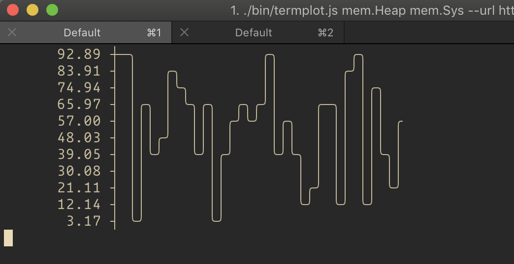

termplot
--------

> Tracks expvar-like (JSON) metrics and plot their evolution over time right in the terminal



Toy project. I have no intention to maintain this.

# Usage

Given that `localhost:3000` is spitting stats like this. Example server included in `examples/server.js`.
You can start it with `node example/server.js`

```json
{
   "mem": {
      "Heap": 1234,
      "Sys": 4321,
      "Stack": 203
   },
   "cpu": {
      "STime": 123,
      "UTime":1234
   },
   "Threads": 2
}
```

You can use the command below to graph the values over time.

```bash
$ termplot --url http://localhost:3000 --rows 10 mem.Heap
```

# Todo

- Multiple field paths
- Color